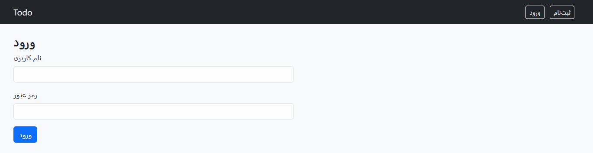

# 📝 Todo List Web App

A simple **Todo List web application** built with **Python (Flask/Django)**.  
This project allows users to register/login, manage their daily tasks (CRUD operations), categorize them, and mark them as completed or pending.

---

## 🚀 Features
- User authentication (Sign up & Login)
- Add, edit, delete, and view tasks (CRUD)
- Task categories
- Mark tasks as completed or pending
- Simple and clean UI

---

## ⚙️ Installation & Setup

### Prerequisites
- Python 3.10+
- pip
- virtualenv (recommended)

### Steps
```bash
# Clone the repository
git clone https://github.com/USERNAME/todo-app.git
cd todo-app

# Create a virtual environment
python -m venv venv
source venv/bin/activate   # macOS/Linux
venv\Scripts\activate      # Windows

# Install dependencies
pip install -r requirements.txt

# Run the server
python manage.py runserver   # Django version
# or
python app.py                # Flask version

# Now open in your browser:
# http://127.0.0.1:8000   (Django)
# http://127.0.0.1:5000   (Flask)
```
🎥 Demo



📦 Tech Stack

Backend: Python, Flask / Django

Database: SQLite (default) or PostgreSQL

Frontend: HTML, CSS, Bootstrap


👤 Author
Mehdihoseini

📌 Notes

This project was built as a learning and practice project and can be used as part of a developer portfolio to demonstrate backend and full-stack development skills.
